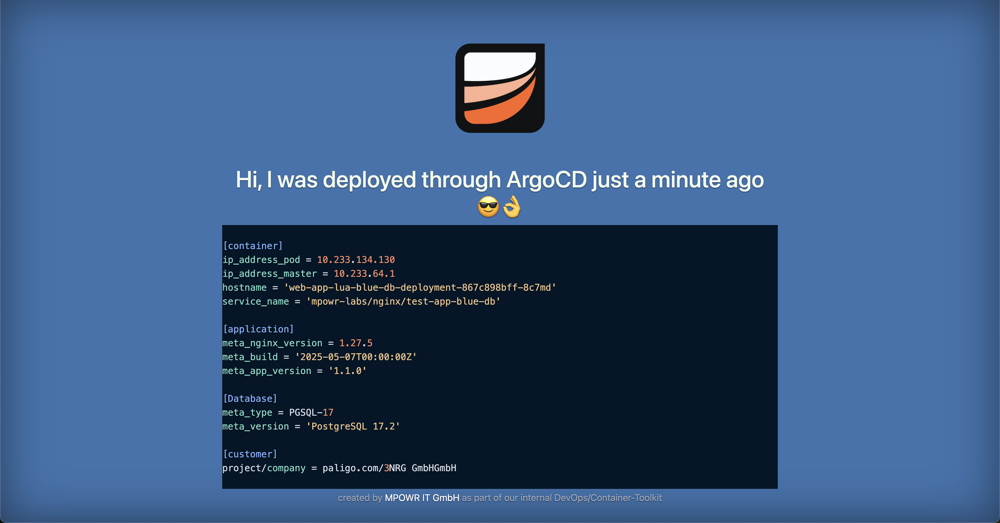

# OPS/k8s Web-Application, NGINX+LUA (static/blue) with PGSQL

## Table of contents
* [General](#general)
* [Error Handling](#error-handling)
* [Purpose](#goals--purpose-of-this-app)
* [Technologies](#technologies--requirements)
* [Build](#build)
* [Run](#run)
* [Issues](#issues)
* [Links](#links)

## General

This repository contains a simple static web application for testing multiple deployment strategies in docker-compose, openshift or kubernetes (RKE,GKE,EKS & AKS). The NGINX-version used is based on the lua-module-enabled nginx-alpine build by [fabiocicerchia](https://github.com/fabiocicerchia/nginx-lua) and extends the static view with some additional meta-information around the running container. The information is largely obtained from the environment variables provided by the base image used. Details can be found in the table below.

| ENV-Variable                   | Description                                   | source              |
|--------------------------------|-----------------------------------------------|---------------------|
| `C_MESSAGE`                    | a custom message shown in this app            | _external_          |
| `C_IMG_META_TAG`               | the image tag used to spin up this container  | `$DOCKER_IMAGE_TAG` |
| `C_IMG_META_OS`                | the image operating system of this container  | `$DOCKER_IMAGE_OS`  |
| `C_IMG_META_NGINX_VERSION`     | the image nginx-version of this container     | `$VER_NGINX`        |
| `C_IMG_META_NGINX_LUA_VERSION` | the image nginx-lua-version of this container | `$VER_LUA`          |
| `C_IMG_BUILD_DATE`             | the image build date of this container        | `$BUILD_DATE`       |

You can adjust the amount of meta-information output at any time. For the most part, I use the environment variables of the container runtime environment, but more complex queries can also be imported via the [lua extension](https://www.nginx.com/resources/wiki/modules/lua/) of nginx.

## Error Handling

This web application also supports server-side error handling by directly entering the error code as uri-routing parameter. For example, using the following URL will generate the error code 404 (file not found).

* `http://localhost:<8080>/error/404`

_Currently, only error codes from 400 to 511 are supported. The corresponding mapping can be seen (and extended) in the nginx-config (line 29++)_

### Goals & Purpose of this APP

- provide a simple static web application with additional container runtime information
- small docker images size by using alpine/nginx and embedded + minified css/js assets
- usable for multiple container orchestration frameworks/services (k8s, rke, openshift etc.)
- no additional sidekick-service or script-overhead
- tested payload artefact

## Technologies & Requirements

This APP is a simple web application that provides static content and some dynamic information about the runtime environment. The core of the application is based on the nginx webserver and the dynamic content is provided by the included lua module. In the context of a Kubernetes orchestration, this application outputs helpful information about the current runtime environment of the cluster (e.g., pod IP of the started container). To build and launch the application on the local development environment, docker should be used as a containerisation service. The requirements for this can be found in the respective accompanying documentation of the framework.

## Build

* run `$ docker build -t mpowr-it-local/k8s-app-nginx-lua-db .`

## Run

### Local Container Test (static)

* switch to repository root directory
* run `$ docker build -t mpowr-it-local/k8s-app-nginx-lua-db .`
* run `$ docker run -d -p 8080:80 mpowr-it-local/k8s-app-nginx-lua-db`
* open `http://localhost:8080` on your local machine using your favorite browser

_you can also pull this image repository directly from our public docker hub `mpowr/k8s-app-nginx-lua-db:tagname`_

### Local Container Test (dynamic message)

* switch to repository root directory
* run `$ docker build -t mpowr-it-local/k8s-app-nginx-lua-db .`
* run `$ docker run -d -p 8080:80 -e C_MESSAGE="welcome to nginx" mpowr-it-local/k8s-app-nginx-lua-db`
* open `http://localhost:8080` on your local machine using your favorite browser

_In this case, the message "welcome to nginx" will be displayed instead of the standard message._

## Build-Pipeline (CI/CD)

All changes to this repository will be tested and pushed via the release branch result as an automatically provided Docker-Image using Github-Actions.

- https://github.com/mpowr-it/cu20240002-paligo-marketplace

## Issues

It can happen that when trying to start the container an error message appears concerning the port to be used. As a solution, you should look for an already running container of the same image type (_and terminate it if necessary_) or select a different destination port (default = `8080`) on the carrier system.

## Links

- https://github.com/fabiocicerchia/nginx-lua
- https://www.nginx.com/resources/wiki/modules/lua/
- https://blog.adriaan.io/one-nginx-error-page-to-rule-them-all.html

## License

See [LICENSE](LICENSE) for full details.

    Licensed to the Apache Software Foundation (ASF) under one
    or more contributor license agreements.  See the NOTICE file
    distributed with this work for additional information
    regarding copyright ownership.  The ASF licenses this file
    to you under the Apache License, Version 2.0 (the
    "License"); you may not use this file except in compliance
    with the License.  You may obtain a copy of the License at

      https://www.apache.org/licenses/LICENSE-2.0

    Unless required by applicable law or agreed to in writing,
    software distributed under the License is distributed on an
    "AS IS" BASIS, WITHOUT WARRANTIES OR CONDITIONS OF ANY
    KIND, either express or implied.  See the License for the
    specific language governing permissions and limitations
    under the License.

## Copyright

Copyright © 2025 MPOWR IT GmbH
